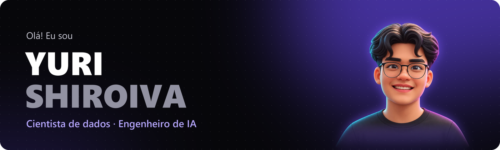

  
  
  
  

Sou cientista de dados e engenheiro de IA em Curitiba, com mais de 2 anos de experiência. Na **IoTag**, cuido do pipeline de dados e da parte de IA de uma plataforma que recebe a telemetria de máquinas agrícolas. Fora do trabalho, pesquiso deep learning com imagens de satélite. O que mais me motiva é ver um modelo sair do notebook e ser usado por alguém.

### No dia a dia

- **LLMs e agentes em produção:** diagnóstico de máquinas com o Claude na Vertex AI, com resposta estruturada e validada por schema, e agentes que usam ferramentas via MCP.
- **Pipelines de telemetria:** dados brutos de CAN e ISOBUS viram datasets organizados, mapas de cobertura em GeoJSON e arquivos ISOXML.
- **Machine learning e séries temporais:** modelos com validação cruzada e métricas que fazem sentido para o problema.
- **Visão computacional:** segmentação e classificação com PyTorch e visão clássica com OpenCV, de imagens de satélite a peças industriais.

### Projetos em destaque

<table>
  <tr>
    <td width="50%" valign="top">
      
       <b>Talhões por satélite</b> TCC · PUCPR
       Deep learning com imagens Sentinel-2 que encontra cada talhão e entrega os polígonos numa plataforma web. Dice mediano de 0,87; no Brasil, o fine-tuning regional levou o Dice de 0,25 para 0,72.
       <a href="https://yurishiroiva.github.io/projetos/talhoes.html">Estudo de caso</a> · <a href="https://github.com/YuriShiroiva/talhoes-sentinel2">Código</a>
    </td>
    <td width="50%" valign="top">
      
       <b>FolhaSã</b> Visão computacional
       Reconhece 10 condições da folha do tomateiro a partir de uma única foto. Acertou 99,9% das imagens de teste. Modelo exportado para ONNX e servido por uma API em FastAPI.
       <a href="https://yurishiroiva.github.io/projetos/folhasa.html">Estudo de caso</a>
    </td>
  </tr>
  <tr>
    <td width="50%" valign="top">
      
       <b>Redes neurais: câmbio e CO₂</b> Data Science
       LSTM em PyTorch que prevê a cotação do dólar (R² de 0,92 no teste) e rede competitiva que agrupa veículos por cilindrada, eficiência e emissão de CO₂.
       <a href="https://yurishiroiva.github.io/projetos/redes-neurais.html">Estudo de caso</a>
    </td>
    <td width="50%" valign="top">
      
       <b>Falhas industriais</b> OpenCV
       Visão computacional clássica, sem rede neural, que encontra e destaca uma rachadura numa chapa de metal: CLAHE, Canny e morfologia.
       <a href="https://yurishiroiva.github.io/projetos/falhas.html">Estudo de caso</a>
    </td>
  </tr>
</table>

**Mais em dados:** [Redes de Game of Thrones](https://github.com/YuriShiroiva/redes-game-of-thrones) (grafos e centralidade) · [Cadastros duplicados com Levenshtein](https://github.com/YuriShiroiva/levenshtein-duplicados) · [Covid-19 no Brasil](https://github.com/YuriShiroiva/Projeto-Covid-19-) (ARIMA e Prophet) · [Previsão de chuva na Austrália](https://github.com/YuriShiroiva/IBM-Lab-Rain-Prediction-in-Australia)

### Stack

  
  
  
  
  
  
  
   
  
  
  
  
  
   
  
  
  
  
  
  
  

### Formação

**Tecnólogo em Inteligência Artificial Aplicada** pela PUCPR (2024 a 2026), com média 9,27 e Menção Honrosa.

**Certificados**

| Instituição | Certificado | Ano |
|---|---|---|
| IBM | Generative AI Engineering e Generative AI Engineering with LLMs | 2026 |
| Kaggle | Computer Vision e Intermediate Machine Learning | 2026 |
| DeepLearning.AI | Supervised ML: Regression and Classification | 2025 |
| IBM | Data Science Professional e Applied Data Science | 2024 |
| Google | Data Analytics | 2023 |

---

  Aberto a oportunidades em dados e IA. O jeito mais rápido de falar comigo é por <a href="mailto:yurishiroivabr@gmail.com">e-mail</a>.

